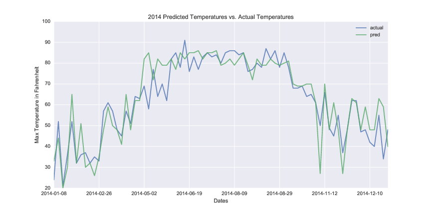
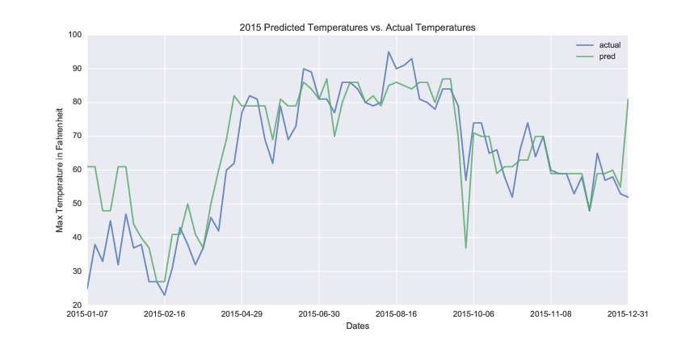

# Project Paper
By: Patrick White  
[whitep@vcu.edu](mailto:whitep@vcu.edu)  

### Problem Statement
- New Yorker's complain about everything, if it's possible to complain about, a New Yorker has complained about it. I am curious if there are weather influences on a New Yorker's day to day disposition. I believe that if I model two years of historic NYC 311 calls using logistic regression, then the model will show that there is a relationship between complaint levels, and temperature in Fahrenheit.  

### Data set history
- The data set I obtained was through [NYC OpenData](https://nycopendata.socrata.com/). At the time I gathered it I was under a time crunch so I was unable to use their API and had to just grab the CSV file from the site itself. This wasn't desirable initially, but considering the size of 2 years worth of 311 calls having it stored as local files would have been the polite method of doing this.  The data set contained 52 rows and I only ended up using 2 columns; the first was the open date of the 311 call, this is the time received not the time the call was responded to or closed. In addition to this data I also had to obtain historical weather data for 2014 & 2015. I used [AccuWeather.com](http://www.accuweather.com/) and grabbed the last two years of maximum temperatures in F, as well as the general forecast. General forecast was a categorical set so I had to use ```get_dummies()``` to break the possible forecast into sepearate columns and give them binary values.  

## Cleaning and Sanitizing my data set
The initial data set took about 10 - 12 minutes to read into a dataframe. Luckily I didn't need a large amount of the information in the set so I dropped the following features:
```
[Unique Key,Closed Date,Agency,Agency Name,
Descriptor,Location Type,Incident Zip,
Incident Address,Street Name,Cross Street 1,
Cross Street 2,Intersection Street 1,
Intersection Street 2,Address Type,City,
Landmark,Facility Type,Status,Due Date,
Resolution Description,Resolution Action Updated Date,
Community Board,Borough,X Coordinate (State Plane),
Y Coordinate (State Plane),Park Facility Name,
Park Borough,School Name,School Number,
School Region,School Code,School Phone Number,
School Address,School City,School State,
School Zip,School Not Found,School or Citywide Complaint,
Vehicle Type,Taxi Company Borough,Taxi Pick Up Location,
Bridge Highway Name,Bridge Highway Direction,Road Ramp,
Bridge Highway Segment,Garage Lot Name,Ferry Direction,
Ferry Terminal Name,Latitude,Longitude,Location]
```
Whew!  
A lot of the data had very similar complaint types even though they had distinct values for that field (over 180), so my next move was to try collapsing this data set into something smaller and to generalize the complaint types into smaller buckets. An example of the similarity is the two different complaint types, 'Request for bulk item pickup' and 'Request for bulk pickup'.

**Buckets to classify complaint type as:**
```
['Building_Conditions', 'General_Request',
 'Living_Conditions', 'Parking_Enforcement',
 'Signal_Sign_Repair', 'Street_Sidewalk_Repair']
 ```  

Some examples of complaint types I bucketed:  

 **Building Conditions**:
 - Heat/Hot water
 - Plumbing
 - Water Leak
 - Electrical Wires
 **General Request**:
 - Other:Complaint
 - Schedule Bulk Item pickup
  - Sticker Request
 - State/City Agency Form request
 **Living Conditions**:
 - Sanitation Conditions
 - Unsanitary Conditions
 - Sewer
 - Rodent
 - Infestation
 **Signal/Sign Repair**:
 - Broken traffic Signal
 - Street sign missing/broken
 **Street/Sidewalk Repairs**:
 - Pothole
 - Snow Removal
 - Plow request
 **Parking Enforcement**:
 - Abandoned car
 - Towed car information
 - Blocked Driveway

## Observations  
- Through my analysis of the data set I was able to get multiple visualizations using different methods of comparison of weather's effect on complaint type. Unfortunately none of them gave me very good scores. The best accuracy score I was able to obtain was got was for temperature using all columns (complaint types and weather data): 0.136986.





I tried to visualize as much as I could (located in ```./clean_data/final/nyc/pngs```) and saw similar graphs but with much worse accuracy scores, so I deemed those other feature combinations to be a poor judge of the relationship between weather and NYC 311 complaints.  

## Features and Analysis
- I chose only those features which seemed to be directly related to the response I was looking for. When adding in weather data I was hesitant to include the forecast data (weather, sunny, etc.) because if a day was marked 'Sunny' the chances of the weather temperature being higher than other days would have been better. Similarly if the forecast was 'Snowy' then it would cut a lot of the possible temperatures the prediction could have been.  

## Modeling Process
- I used ```LogisticRegression()``` from ```scikit-learn```. I used this because there was categorical data to classify (weather forecast). I concatenated the two years of data I had into one dataframe. I used ```'Created_Date'``` as the index to ensure while plotting my points appeared in the correct location. After I was able to fit and plot my data into the ```LogisticRegression model()``` I wanted to check the accuracy. I observed some pretty crazy log_loss and accuracy scores, most times I attempted to fit the model using a complaint type as the response the log_loss was above 4 and accuracy score was 0.0. The highest accuracy score I achieved, as mentioned earlier, was 0.136986.  

## Challenges
- I had some pretty large external challenges as well as a few related to the class/project. Externally, my free time was seriously cut back due to a promotion I received in December. While a promotion is typically a great thing, this promotion ended up requiring a large amount of front loaded work all needing to be done yesterday. Thats a bad excuse but still a factor. Another challenge was trying to work with such a large data set. I considered creating a small SQLite DB to port around with the model, but doing that turned out to be a [yak shaving](https://en.wiktionary.org/wiki/yak_shaving) situation. Some of the categorizing of complaint types into a more general form could be interpreted differently, for instance where I would call an issue with a buildings heating or hot water a building condition, others could argue that it's a living condition issue, this adds in an element of bias towards the modeling process. Besides those things I had to change my project topic a couple weeks before the draft was due, so I was behind the 8 ball trying to come up with a replacement project. Here are some old project links:
  - [trek_predict](https://github.com/Whitepatrick/trek_predict) - This repo contains some of the code I was using to grab data from IMDb, as well as some JSON files containing Star Trek episode ratings.
  - [trek_blog](https://github.com/Whitepatrick/trek_blog) - This was the moonshot, I wanted to host the prediction code on a django app and continuously measure the accuracy of my model, this is still a good base though, includes a MongoDB backend to store info.

## Successes
- Being able to shrink down a 3GB csv file into something about 260MB was pretty awesome. It was really unwieldy to try working with at first since reloading my dataframe took so long. The other alternative was to break out the csv into smaller files, which I did for a little while. But doing this introduced too much complexity into the dataframes and model and required dark arts to properly combine the dataframes in useful ways.  

## Possible extensions or business applications of your project  
- I originally wanted to include geographical data that came in the raw data set. I wanted to use this data to apply to a heat map so I could show not only the predicted complaint levels dependent on the weather, but also show _where_ the estimated complaints would appear. Another method I wanted to implement would be to continuously grab new forecast info from [AccuWeather](http://www.accuweather.com/) and continuously improve the performance of my model. By adding in new data and retraining I believe overtime the predictions would become very reliable.  

## Conclusion  
- I believe my the complaints generated by New Yorkers calling into 311 are very related to the weather in indirect ways. For instance if a recent snow storm has created a situation where cars are unable to move to or allow for street cleaning on snow emergency routes. The city has an obligation to provide clear safe paths of ingress or egress during an emergency, but when that emergency is over not everyone can move their car immediately to avoid street cleaning, possibly resulting in high call volume to see if you were courtesy towed or towed to impound. The log_loss and accuracy scores I saw were sort of dubious, but the visualizations showed promise. I definitely liked the classification models and can see practical uses in them for my day job and will ideally help make some of our _quirky_ environments to behave in a more predictable manner.  
